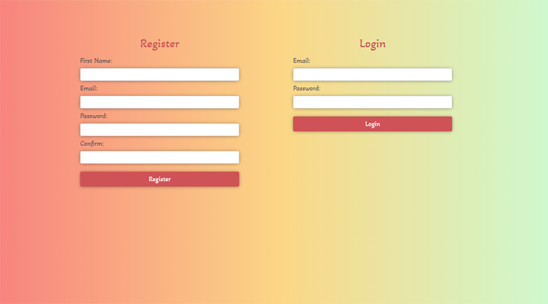

## Python Django Authentication 
### Introduction
A simple registration/login application that can be used in different Django projects

### Running Locally
Clone the repository with `git clone https://github.com/MaryamWeb/Django_authentication.git` or download it. 

make sure you are in the correct directory.

### Creating a virtual environment:
`py -m venv ENV_NAME`

### Activate the virtual environment:
`call ENV_NAME\Scripts\activate` 

### PIP Dependencies
In the terminal run `pip install -r requirements.txt` This will install all of the required packages.

### Run database migrations
`python manage.py migrate`

## Running Your app locally
Make sure you are in the correct directory then activate your virtual enviornment   --> `call env_sportsquiz\Scripts\activate`

run `python manage.py runserver 7000`

to view in the browser open `http://localhost:7000/`

## Project Screen Shot:
